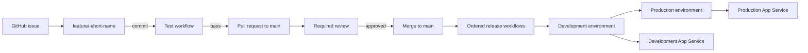
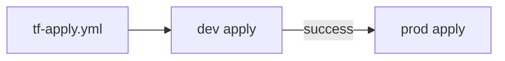
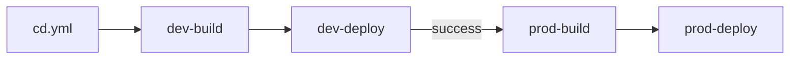
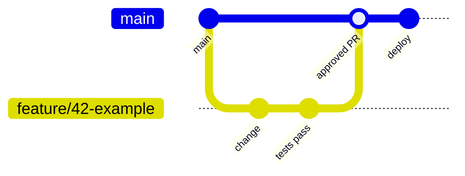

- [DTAP Automation PoC](#dtap-automation-poc)
  - [Objectives](#objectives)
  - [Suggested branch strategy](#suggested-branch-strategy)
  - [Release flows](#release-flows)
  - [Issue drift check](#issue-drift-check)
  - [Documentation](#documentation)
  - [PoC boundary](#poc-boundary)

# DTAP Automation PoC

This repository is a proof of concept for a controlled, automated change
process for a single-page web application deployed to Azure App Service.

## Objectives

- Use `main` as the origin.
- Track every change with a GitHub issue. (Change Management)
- Implement each issue on a short-lived feature branch.
- Open a pull request (PR) from the feature branch to `main`.
- Run the test workflow on every feature-branch commit.
- Require review and prevent direct commits to `main`.
- On every approved merge to `main`, apply the Terraform configuration and
  deploy the site through the protected `Development` and `Production`
  GitHub environments.
- Store immutable site packages in the Azure Storage Account `release`
  container and deploy them to App Service.
- Require approval through the protected `Production` GitHub environment
  before production changes are applied or deployed.
- Keep the process fully automated; configuration is managed as code rather
  than through click-ops.

## Suggested branch strategy

Rules:

1. Create an issue before making a change.
2. Create a feature branch from `main`, preferably named
   `feature/<issue-number>-<short-name>`.
3. Push commits only to the feature branch and open a PR to `main`.
4. Require passing checks, a review, and CODEOWNER approval before merging.
5. Protect `main` against direct pushes and force pushes.
6. Configure `Development` and `Production` GitHub environments. Add required
   reviewers to `Production` and restrict the environments to the appropriate
   deployment branches.
7. Configure the Azure OIDC secrets (`AZURE_CLIENT_ID`,
   `AZURE_TENANT_ID`, and `AZURE_SUBSCRIPTION_ID`) in each environment.
8. Configure the environment variables `AZURE_STORAGE_ACCOUNT`,
   `APP_SERVICE_NAME`, and `ENVIRONMENT`. The site build uses `ENVIRONMENT`
   to update the environment label in `src/index.html`.
9. Configure Github Action secrets for `Drift-Check`, add `OPENAI_API_KEY` as a secret
10. Configure the Github Action variable `OPENAI_API_URL` for `Drift-Check`.
   This may be an OpenAI-compatible chat-completions URL or an Azure OpenAI
   resource URL such as `https://<resource>.openai.azure.com/`.
   The model is selected from the workflow input and defaults to `gpt-5.4-mini`;
   `gpt-5.4` and `claude-sonnet-5` are also available.
11. The `Drift-Check` runs
   on every PR commit and requires a branch name beginning with
   `feature/<issue-number>-`.

## Release flows

Both release workflows promote from Development to Production. Production
does not start until the Development stage has completed successfully. The
Production GitHub environment can add its required-reviewer approval as an
additional gate.

Terraform infrastructure promotion:

Application continuous deployment:

The branch strategy is intentionally trunk-based: work starts on a
short-lived `feature/<issue-number>-<short-name>` branch, checks run on the
pull request, and only an approved merge to protected `main` triggers these
promotion flows. There are no separate long-lived `dev` or `prod` branches;
the GitHub environments provide deployment isolation and the workflow
dependencies provide promotion order.

## Issue drift check

The `Drift-Check` workflow validates that a pull request implements the GitHub
issue identified by its feature branch. Branches must use the
`feature/<issue-number>-<short-name>` format; the workflow extracts the issue
number from the branch name and fails early for other branch formats.

The workflow invokes [`scripts/drift_check.py`](scripts/drift_check.py), which
uses the GitHub API to retrieve:

- The linked issue title and body.
- The pull request title and body.
- The pull request's changed-file patches.
- The final contents of changed files at the pull request head commit.

The script sends that evidence to an OpenAI-compatible chat-completions
endpoint and requires a JSON response containing `aligned`, `missing`, and
`summary`. It evaluates the final repository state, so requirements are not
considered missing merely because the relevant line was unchanged in the PR.
The check fails only when the response identifies a concrete, material
omission or contradiction.

The workflow runs automatically for opened, synchronized, reopened, and
ready-for-review pull requests. It can also be started manually with a pull
request number and one of the configured models. Configure
`OPENAI_API_KEY` as a GitHub Actions secret and `OPENAI_API_URL` as a GitHub
Actions variable. The model defaults to `gpt-5.4-mini` and can be overridden
for manual runs.

## Documentation

- [Architecture summary](docs/architecture-summary.md) - Azure App Service,
  Blob Storage, and authentication architecture.
- [Assumptions](docs/assumptions.md) - scope and organizational assumptions.
- [DTAP setup](docs/DTAP-SETUP.md) - repository setup, environment
  configuration, and deployment workflow notes.
- [Continuous deployment workflow](.github/workflows/cd.yml) - builds and
  deploys the site to the Development and Production environments.
- [Issue drift check workflow](.github/workflows/drift-check.yml) - runs the
  automated issue/PR alignment check.
- [Drift-check script](scripts/drift_check.py) - fetches issue, PR, patch, and
  final-file evidence and evaluates it with the configured model.

## PoC boundary

The process is the focus. The application is intentionally simple. The
implemented deployment target is Azure App Service, with Azure Blob Storage
used as the immutable package store.
