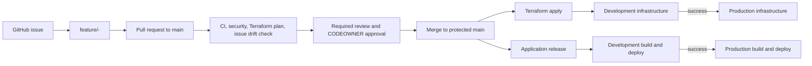
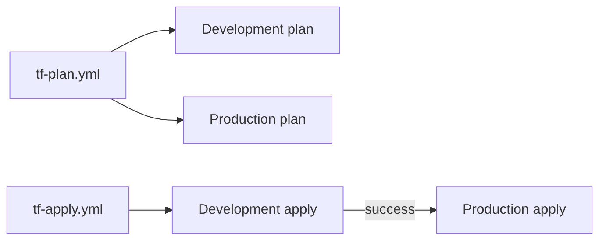
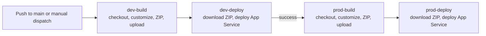

- [DTAP Automation PoC](#dtap-automation-poc)
  - [Start here](#start-here)
  - [What this repository demonstrates](#what-this-repository-demonstrates)
  - [Repository map](#repository-map)
  - [Delivery lifecycle](#delivery-lifecycle)
  - [Pull-request checks](#pull-request-checks)
  - [Infrastructure workflow](#infrastructure-workflow)
  - [Application release](#application-release)
  - [Required GitHub configuration](#required-github-configuration)
  - [Scope and limitations](#scope-and-limitations)
  - [Documentation index](#documentation-index)

# DTAP Automation PoC

This repository is a proof of concept for a controlled, automated release
process for a static single-page application (SPA). It combines GitHub issues
and pull requests, GitHub Actions, Terraform, Azure Blob Storage, and Azure
App Service.

## Start here

| If you want to...                                   | Read                                                 |
| --------------------------------------------------- | ---------------------------------------------------- |
| Understand exactly what happens during a release    | [Application release flow](docs/release-flow.md)     |
| Set up the repository and GitHub environments       | [DTAP setup](docs/DTAP-SETUP.md)                     |
| Understand the Azure architecture and identity flow | [Architecture summary](docs/architecture-summary.md) |
| Understand the scope and assumptions of this PoC    | [Assumptions](docs/assumptions.md)                   |
| Inspect the deployed SPA                            | [`src/`](src/)                                       |
| Inspect the infrastructure definition               | [`iac/`](iac/)                                       |

The most important release document is
[docs/release-flow.md](docs/release-flow.md). It contains the detailed
diagrams and step-by-step behavior for build, Blob Storage upload, package
download, and App Service deployment.

## What this repository demonstrates

- Trunk-based delivery through protected `main`.
- Issue-driven feature branches named
  `feature/<issue-number>-<short-name>`.
- Pull-request validation, secret scanning, and workflow security scanning.
- Automated verification that a pull request satisfies its linked issue.
- Terraform plan and apply for Development and Production infrastructure.
- Environment-specific SPA packages stored in a private Azure Blob Storage
  `release` container.
- Ordered application promotion:
  Development build -> Development deploy -> Production build ->
  Production deploy.
- Azure authentication from GitHub Actions using OpenID Connect (OIDC)
  instead of stored Azure credentials.
- Production approval through the protected GitHub `Production` environment.

This is a process-focused PoC. The application itself is intentionally a
small static site.

## Repository map

| Path                                                                                               | Purpose                                                                                    |
| -------------------------------------------------------------------------------------------------- | ------------------------------------------------------------------------------------------ |
| [`src/`](src/)                                                                                     | Static SPA source: `index.html`, `styles.css`, and `script.js`.                            |
| [`iac/`](iac/)                                                                                     | Root Terraform configuration, environment backends/variables, and the reusable SPA module. |
| [`scripts/drift_check.py`](scripts/drift_check.py)                                                 | Collects issue, PR, patch, and final-file evidence for the issue drift check.              |
| [`.github/workflows/ci.yml`](.github/workflows/ci.yml)                                             | Validates site files and JavaScript, scans for secrets, and scans workflows.               |
| [`.github/workflows/drift-check.yml`](.github/workflows/drift-check.yml)                           | Checks whether a pull request implements its linked issue.                                 |
| [`.github/workflows/cd.yml`](.github/workflows/cd.yml)                                             | Application release entry workflow.                                                        |
| [`.github/workflows/build-template.yml`](.github/workflows/build-template.yml)                     | Reusable environment-specific build and Blob Storage upload workflow.                      |
| [`.github/workflows/deploy-template.yml`](.github/workflows/deploy-template.yml)                   | Reusable Blob Storage download and App Service deployment workflow.                        |
| [`.github/workflows/tf-plan.yml`](.github/workflows/tf-plan.yml)                                   | Terraform plan entry workflow for Development and Production.                              |
| [`.github/workflows/tf-apply.yml`](.github/workflows/tf-apply.yml)                                 | Ordered Terraform apply entry workflow.                                                    |
| [`.github/workflows/terraform-plan-template.yml`](.github/workflows/terraform-plan-template.yml)   | Reusable Terraform plan workflow.                                                          |
| [`.github/workflows/terraform-apply-template.yml`](.github/workflows/terraform-apply-template.yml) | Reusable Terraform apply workflow.                                                         |
| [`docs/`](docs/)                                                                                   | Setup, architecture, assumptions, and detailed release documentation.                      |

## Delivery lifecycle

There are no long-lived `dev` or `prod` branches. GitHub environments provide
deployment isolation and approval gates, while workflow dependencies enforce
the promotion order.

## Pull-request checks

The [CI workflow](.github/workflows/ci.yml) runs for pull requests to `main`
and pushes to `main`. It:

1. Checks that the required SPA files exist and that `index.html` references
   the JavaScript file.
2. Checks JavaScript syntax with `node --check`.
3. Scans for accidentally committed secrets with Gitleaks.
4. Scans GitHub Actions workflows with Zizmor.
5. Requires pull requests to originate from a `feature/*` branch.

The [issue drift check](.github/workflows/drift-check.yml) runs for opened,
synchronized, reopened, and ready-for-review pull requests. It extracts the
issue number from the feature branch, retrieves issue and pull-request
evidence from GitHub, and asks the configured OpenAI-compatible endpoint
whether the final repository state satisfies the issue. A non-aligned result
fails the check.

The drift check can also be started manually with a pull request number and
one of the configured models. It requires `OPENAI_API_KEY` as a secret and
`OPENAI_API_URL` as a GitHub Actions variable.

## Infrastructure workflow

Terraform is split into entry workflows and reusable templates:

The root Terraform configuration in [`iac/`](iac/) instantiates the SPA
module for the selected environment. The module provisions:

- An Azure resource group.
- An Azure App Service plan.
- An Azure App Service for the SPA.
- An application storage account with a private `release` container.
- Blob data permissions for the deployment identity.

Terraform state is stored remotely in Azure and is not committed to Git.
See [`iac/README.md`](iac/README.md) for generated Terraform module details.

## Application release

The [application release workflow](.github/workflows/cd.yml) runs on pushes to
`main` and manual dispatches:

Each build:

1. Checks out the repository.
2. Updates the existing `src/index.html` environment label from the
   environment's `ENVIRONMENT` variable.
3. Creates a timestamped `site-<environment>-<timestamp>.zip` from `src/`.
4. Logs in to Azure with OIDC.
5. Uploads the ZIP to the private Blob Storage `release` container.

Each deploy:

1. Logs in to Azure with OIDC.
2. Validates the package filename.
3. Downloads the exact ZIP named by the preceding build.
4. Deploys it to the environment's App Service with
   `azure/webapps-deploy`.

The ZIP is handed from build to deploy through its filename and Blob Storage;
it is not passed as a GitHub Actions artifact. Production starts only after
the complete Development build and deployment succeeds. The detailed
step-by-step diagrams, artifact lifecycle, configuration, and rollback notes
are in [docs/release-flow.md](docs/release-flow.md).

## Required GitHub configuration

Create the `Development` and `Production` GitHub environments. Each
environment needs:

- OIDC secrets: `AZURE_CLIENT_ID`, `AZURE_TENANT_ID`, and
  `AZURE_SUBSCRIPTION_ID`.
- Variables: `AZURE_STORAGE_ACCOUNT`, `APP_SERVICE_NAME`, and `ENVIRONMENT`.

Configure required reviewers for `Production` if production approval is
required. The deployment identity must have `Storage Blob Data Contributor`
access to the application storage account's private `release` container.

Protect `main` with pull requests, required approvals, required status checks,
CODEOWNER review, and disabled force pushes.

For the complete setup procedure, see
[docs/DTAP-SETUP.md](docs/DTAP-SETUP.md).

## Scope and limitations

- The intended lifecycle has Dev, Test, QA, pre-production, and Production
  stages, but this PoC implements only `dev -> prod`.
- The application is a simple static SPA; the release process is the primary
  subject of the PoC.
- The current release entry workflow creates a new package on every run. It
  does not yet expose a manual package-selection input for rollback, although
  timestamped packages remain in Blob Storage.

See [docs/assumptions.md](docs/assumptions.md) for the full assumptions list.

## Documentation index

- [Application release flow](docs/release-flow.md)
- [DTAP setup](docs/DTAP-SETUP.md)
- [Architecture summary](docs/architecture-summary.md)
- [Assumptions](docs/assumptions.md)
- [Terraform module documentation](iac/README.md)
