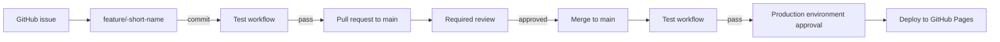
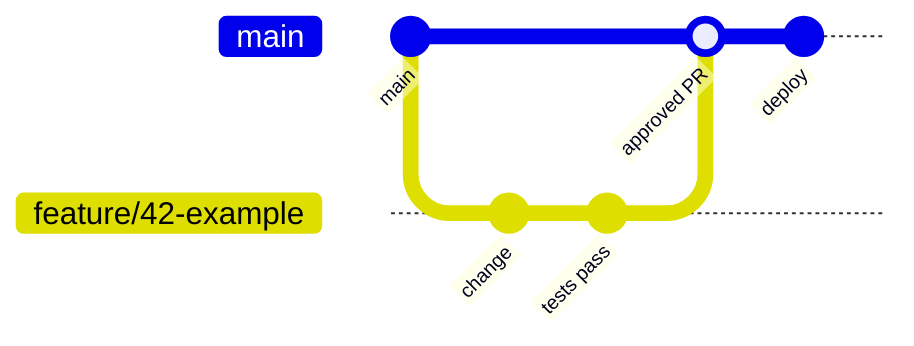

# DTAP Automation PoC

This repository is a proof of concept for a controlled, automated change
process for a single-page web application.

## Objectives

- Use `main` as the origin.
- Track every change with a GitHub issue. (Change Management)
- Implement each issue on a short-lived feature branch.
- Open a pull request (PR) from the feature branch to `main`.
- Run the test workflow on every feature-branch commit.
- Require review and prevent direct commits to `main`.
- On every approved merge to `main`, run the same tests and deploy to the
  production environment.
- Require the final approval through a protected GitHub environment before
  deployment.
- Keep the process fully automated; configuration is managed as code rather
  than through click-ops.

## Suggested branch strategy

Rules:

1. Create an issue before making a change.
2. Create a feature branch from `main`, preferably named
   `feature/<issue-number>-<short-name>`.
3. Push commits only to the feature branch and open a PR to `main`.
4. Require passing checks, a review, and CODEOWNER approval before merging.
5. Protect `main` against direct pushes and force pushes.
6. Configure the production environment with required reviewers. A merge
   starts deployment only after that approval.
7. Configure Github Action secrets for `Drift-Check`, add `OPENAI_API_KEY` as a secret
8. Configure the Github Action variable `OPENAI_API_URL` for `Drift-Check`.
   The model is selected from the workflow input and defaults to `gpt-5.4-mini`;
   `gpt-5.4` and `claude-sonnet-5` are also available.
9. The `Drift-Check` runs
   on every PR commit and requires a branch name beginning with
   `feature/<issue-number>-`.

## Documentation

- [Architecture summary](docs/architecture-summary.md) - two simple Azure
  hosting alternatives.
- [Assumptions](docs/assumptions.md) - scope and organizational assumptions.
- [DTAP setup](docs/DTAP-SETUP.md) - repository setup and the existing
  environment-oriented workflow notes.
- [Issue drift check workflow](.github/workflows/drift-check.yml) - validates
  that a PR addresses its linked issue using an OpenAI-compatible endpoint.

## PoC boundary

The process is the focus. The application is intentionally simple, and the
deployment target can be GitHub Pages for the demo or one of the Azure
alternatives described in the architecture summary.
