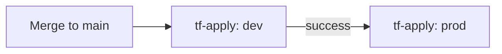
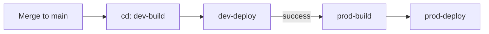

# DTAP deployment POC

This repository contains a GitHub Actions pipeline for Terraform and a static
site deployed to Azure App Service. Workflow logic shared by environments is
implemented in local composite actions and reusable workflow templates.

The continuous deployment entry point is
[`cd.yml`](../.github/workflows/cd.yml). It calls the reusable
[`build-template.yml`](../.github/workflows/build-template.yml) and
[`deploy-template.yml`](../.github/workflows/deploy-template.yml) workflows
for the Development and Production environments.

Terraform uses the same two-layer pattern. The
[`tf-plan.yml`](../.github/workflows/tf-plan.yml) and
[`tf-apply.yml`](../.github/workflows/tf-apply.yml) entry points call
[`terraform-plan-template.yml`](../.github/workflows/terraform-plan-template.yml)
and
[`terraform-apply-template.yml`](../.github/workflows/terraform-apply-template.yml).
Those reusable workflows provide the job-level configuration and call the
local Terraform composite actions for the Terraform commands.

## Promotion flow

Pull requests run CI, security checks, Terraform plan, and the Issue Drift
Check. A merge to protected `main` starts the two ordered release flows:

The Terraform flow applies Development before Production. The application
flow builds and deploys Development before building and deploying Production.
The Production GitHub environment remains the approval gate for production
operations. These dependencies prevent the two environments from running in
parallel.

The branch strategy is trunk-based: create
`feature/<issue-number>-<short-name>` from `main`, open a pull request, pass
the required checks and reviews, then merge to protected `main`. There are no
long-lived environment branches; `Development` and `Production` GitHub
environments provide the release boundaries.

Pull requests also run the Issue Drift Check. The feature branch identifies
the associated issue using `feature/<issue-number>-<short-name>`. The check
fetches the issue, pull request metadata, changed-file patches, and final
contents of changed files at the PR head before asking the configured
OpenAI-compatible model whether the final repository state satisfies the
issue.

Each environment build creates a timestamped ZIP package, updates the site
environment label from the GitHub environment variable `ENVIRONMENT`, and
uploads the package to the private Azure Blob Storage `release` container.
The corresponding deploy job downloads that package and deploys it to the
environment's App Service.

For the complete release diagram and the individual build/deploy steps, see
the [application release flow](release-flow.md).

## One-time GitHub setup

1. In **Settings > Environments**, create `Development` and `Production`.
2. Add required reviewers to `Production`; use branch restrictions suitable
   for the release policy.
3. Add these Azure OIDC secrets to each environment:
   `AZURE_CLIENT_ID`, `AZURE_TENANT_ID`, and `AZURE_SUBSCRIPTION_ID`.
4. Add these environment variables:
   `AZURE_STORAGE_ACCOUNT`, `APP_SERVICE_NAME`, and `ENVIRONMENT`.
   `APP_SERVICE_NAME` must identify the App Service for that environment.
5. Protect `main` under **Settings > Rules > Rulesets**:
   - Require pull requests
   - Require approvals
   - Require `validate` and `workflow-security` checks
   - Require CODEOWNER review
   - Block force pushes
6. Ensure the deployment identity has `Storage Blob Data Contributor` on the
   application's `release` blob container.
7. Configure the drift-check integration:
   - Add `OPENAI_API_KEY` to GitHub Actions secrets.
   - Add `OPENAI_API_URL` to GitHub Actions variables. This may be a
     chat-completions URL, an OpenAI-compatible base URL, or an Azure OpenAI
     resource URL.
   - Keep feature branches in the
     `feature/<issue-number>-<short-name>` format.

## Demo script

1. Create a feature branch and open a pull request.
2. Show the Issue Drift Check resolving the issue from the branch name,
   reading the PR's changed files and final file contents, and returning its
   alignment summary.
3. Show validation, JavaScript syntax checking, secret scanning, and workflow scanning.
4. Merge into `main` and show the Terraform plan/apply jobs using the
   environment-specific `dev` and `prod` variable files.
5. Show `dev-build` and `dev-deploy` creating, uploading, downloading, and
   deploying the Development package.
6. Show `prod-build` and `prod-deploy` doing the same for Production only
   after the Development deployment succeeds.
7. Demonstrate the Production approval gate and redeploy a previous immutable
   package when a rollback is required.

The workflows use GitHub OIDC and environment-scoped configuration. No Azure
credentials or storage keys are stored in the repository.

The Terraform plan workflow can also be started manually with an optional
working directory and a selected `dev` or `prod` environment. The Terraform
apply workflow can be started manually with an optional working directory;
it applies `dev` first and then `prod` through their corresponding GitHub
environments.