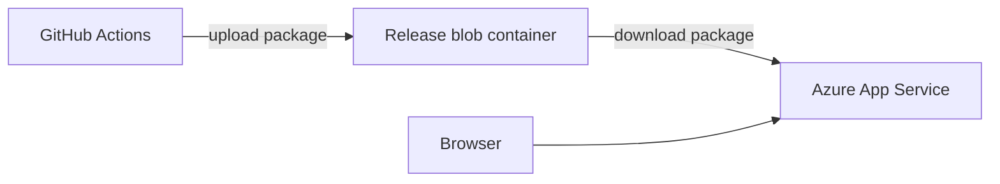
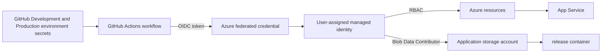

# Architecture summary

The application is a static single-page web app. The CI/CD process builds an
environment-specific package, stores the immutable ZIP in Azure Blob Storage,
and deploys it to Azure App Service through GitHub Actions. Terraform plans
and applies use reusable local composite actions.

## Application hosting: Azure App Service

The SPA module creates one storage account with a private `release` container
and an App Service plan and Linux App Service. The build job uploads the ZIP
package to `release`; the deployment job downloads that package and uses the
App Service ZIP deployment action. The `ENVIRONMENT` GitHub environment
variable is written into the site's environment label during the build.

## GitHub-to-Azure authentication and Terraform state

Terraform and application deployment use GitHub Actions OIDC rather than
long-lived Azure credentials. The Development and Production environments hold
the deployment secrets and configuration; Production additionally requires
approval. A user-assigned managed identity is trusted by the repository's
federated credential and has only the required Azure roles.

The application storage account is separate from the remote Terraform state
storage account. Terraform state uses the `tfstate` container; application
packages use the private `release` container. The deployment identity receives
`Storage Blob Data Contributor` on the `release` container so the workflows can
upload and download packages without storage keys. State is not committed to
Git.
