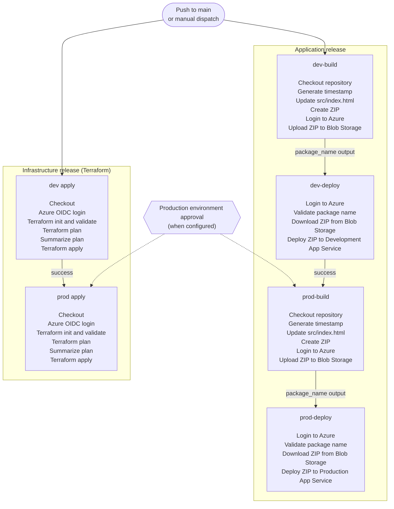
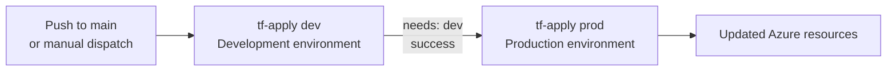
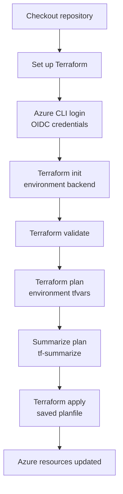
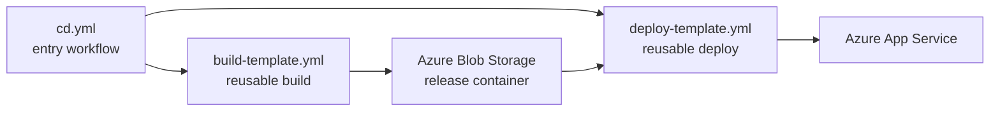
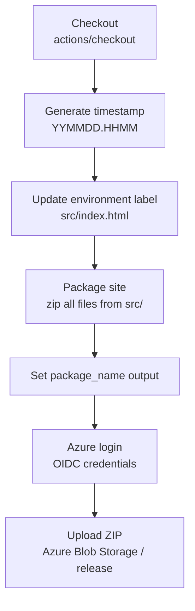
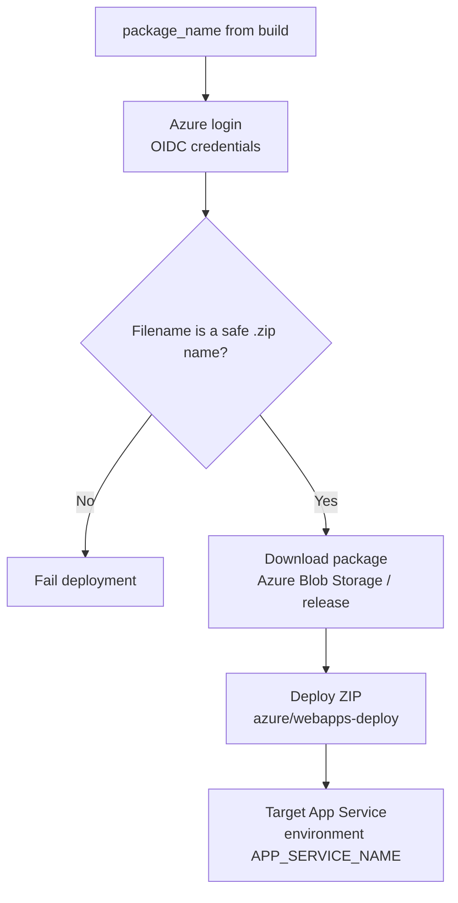
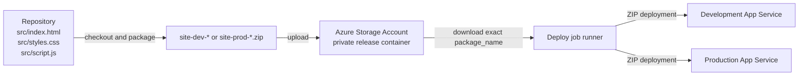

# Release flow

This document describes both release streams performed by this repository:

- **Infrastructure release (IaC)**, which plans and applies the Terraform
  configuration for Development and Production.
- **Application release**, which builds the environment-specific SPA package
  and deploys it to Azure App Service.

The streams are triggered by the same merge to `main`, but they are separate
workflows. Each stream promotes Development before Production; there is no
workflow dependency between the Terraform stream and the application stream.

## When the release starts

The release workflows start as follows:

- [`tf-apply.yml`](../.github/workflows/tf-apply.yml) starts on a push to
  `main` or manual dispatch.
- [`cd.yml`](../.github/workflows/cd.yml) starts on a push to `main` or manual
  dispatch.
- [`tf-plan.yml`](../.github/workflows/tf-plan.yml) starts for pull requests
  targeting `main` or manual dispatch. It validates and plans IaC but does not
  change Azure resources.

The application workflow uses the `dtap-${{ github.ref }}` concurrency group;
the Terraform plan and apply workflows use `tfplan-${{ github.ref }}` and
`tfapply-${{ github.ref }}` respectively. All use
`cancel-in-progress: false`, so a second run waits instead of cancelling an
existing run.

## End-to-end release overview

The Terraform and application streams can run independently after a push to
`main`. Within each stream, Production cannot start until the Development
operation succeeds. The Production GitHub environment can add a required
reviewer gate to both the `prod` Terraform apply and the Production
application jobs.

## Infrastructure release (IaC)

The infrastructure release is implemented by
[`tf-apply.yml`](../.github/workflows/tf-apply.yml), which calls
[`terraform-apply-template.yml`](../.github/workflows/terraform-apply-template.yml)
for each environment:

### Terraform apply steps

The reusable Terraform apply workflow runs on `ubuntu-latest` with the
selected GitHub environment and performs these steps:

1. **Checkout** checks out the Terraform configuration.
2. **Set up Terraform** installs the configured Terraform CLI.
3. **Azure CLI login** authenticates with the environment's OIDC client,
   tenant, and subscription.
4. **Terraform init** selects the environment backend:
   `iac/dev/dev.tfbackend` or `iac/prod/prod.tfbackend`.
5. **Terraform validate** checks the configuration before planning.
6. **Terraform plan** uses the matching variable file
   (`iac/dev/dev.tfvars` or `iac/prod/prod.tfvars`) and writes `planfile`.
   The `-detailed-exitcode` result is preserved for the workflow.
7. **Plan summary** renders the plan in standard and tree formats with
   `tf-summarize`.
8. **Terraform apply** applies the saved `planfile` non-interactively.

The `dev` apply calls the `Development` GitHub environment. The `prod` apply
has `needs: dev` and calls the `Production` environment, so the production
infrastructure change is ordered after Development and can be paused for
approval.

### Terraform plan checks

[`tf-plan.yml`](../.github/workflows/tf-plan.yml) calls
[`terraform-plan-template.yml`](../.github/workflows/terraform-plan-template.yml)
for both `dev` and `prod`. It performs checkout, Terraform setup, Azure OIDC
login, backend initialization, validation, planning, and plan summarization.
It does not run `terraform apply`. This makes the proposed infrastructure
changes visible during pull-request review before a merge can trigger
`tf-apply.yml`.

The Terraform working directory defaults to `./iac`, but both plan and apply
entry workflows support a manual `instanceDirectory` override.

## Workflow and reusable-workflow responsibilities

| Workflow/job | Responsibility | Gate or output |
| --- | --- | --- |
| `dev-build` | Calls `build-template.yml` for `Development` with environment code `dev`. | Publishes `package_name`. |
| `dev-deploy` | Calls `deploy-template.yml` for `Development` using the build output. | Must succeed before `prod-build`. |
| `prod-build` | Calls `build-template.yml` for `Production` with environment code `prod`. | Publishes `package_name`. |
| `prod-deploy` | Calls `deploy-template.yml` for `Production` using the build output. | Final release step. |

The entry workflow owns ordering with `needs`. The reusable templates own the
steps that run on the GitHub-hosted runner. Secrets are inherited from the
selected GitHub environment, and Azure access uses the `id-token: write`
permission for OIDC login.

## Detailed build job

The `build` job in
[`build-template.yml`](../.github/workflows/build-template.yml) runs on
`ubuntu-latest` and selects the GitHub environment supplied by the caller.

1. **Checkout** checks out the repository contents.
2. **Generate timestamp** creates a value such as `260914.1850`.
3. **Update environment in site** replaces the text inside the
   `environment-tag` span in the existing `src/index.html` with the
   environment's `ENVIRONMENT` variable. The workflow does not generate a new
   HTML file; it modifies the checked-out file before packaging.
4. **Package site** creates `site-<environment-code>-<timestamp>.zip` and
   includes the contents of `src/` at the root of the ZIP. This means
   `index.html`, `styles.css`, and `script.js` are deployed as site-root files.
5. **Set output** exposes the exact ZIP filename as `package_name` to the
   caller workflow.
6. **Azure login** obtains an Azure session using the environment's OIDC
   client, tenant, and subscription settings.
7. **Upload to blob** uploads the ZIP to the private `release` container using
   `az storage blob upload --auth-mode login --overwrite`.

The package filename is the hand-off between build and deploy. The ZIP is not
passed as a GitHub Actions artifact; it is stored in Azure Blob Storage.

## Detailed deploy job

The `deploy` job in
[`deploy-template.yml`](../.github/workflows/deploy-template.yml) runs on
`ubuntu-latest` and receives the filename produced by its preceding build.

1. **Azure login** authenticates to the subscription configured by the
   selected GitHub environment.
2. **Validate package name** rejects paths and names that are not safe ZIP
   filenames. This prevents the input from being used as an arbitrary local
   path.
3. **Download package from blob** downloads the exact package from the private
   `release` container to the runner with
   `az storage blob download --auth-mode login`.
4. **Deploy to WebApp** uses `azure/webapps-deploy@v3` with the environment's
   `APP_SERVICE_NAME` and the downloaded ZIP.

## Artifact and resource flow

The storage account and App Services are provisioned by Terraform. The
`release` container is private, and the deployment identity requires
`Storage Blob Data Contributor` access. Development and Production use their
own environment-scoped `AZURE_STORAGE_ACCOUNT` and `APP_SERVICE_NAME`
variables, so a deploy job targets only the App Service selected by its
GitHub environment.

## Configuration used by the release

Each GitHub environment supplies:

- `AZURE_CLIENT_ID`, `AZURE_TENANT_ID`, and `AZURE_SUBSCRIPTION_ID` secrets for
  Azure OIDC login.
- `AZURE_STORAGE_ACCOUNT`, identifying the package storage account.
- `APP_SERVICE_NAME`, identifying the target App Service.
- `ENVIRONMENT`, the label written into `src/index.html` during the build.

The production environment can require reviewers. When configured, GitHub
pauses a production job until the required approval is granted.

## Rollback

Packages remain in the `release` container under their timestamped names.
The current `cd.yml` entry workflow always creates a new package, so it does
not yet expose a manual package-selection input for rollback. A rollback
implementation should pass a selected existing filename to
`deploy-template.yml`; the deployment operation itself is immutable because it
downloads and deploys the exact filename supplied to the deploy template.

## Source of truth

- Infrastructure orchestration: [`tf-plan.yml`](../.github/workflows/tf-plan.yml)
  and [`tf-apply.yml`](../.github/workflows/tf-apply.yml)
- Terraform reusable workflows:
  [`terraform-plan-template.yml`](../.github/workflows/terraform-plan-template.yml)
  and
  [`terraform-apply-template.yml`](../.github/workflows/terraform-apply-template.yml)
- Terraform operations:
  [`terraform-plan/action.yml`](../.github/actions/terraform-plan/action.yml)
  and
  [`terraform-apply/action.yml`](../.github/actions/terraform-apply/action.yml)
- Orchestration: [`cd.yml`](../.github/workflows/cd.yml)
- Build implementation: [`build-template.yml`](../.github/workflows/build-template.yml)
- Deploy implementation: [`deploy-template.yml`](../.github/workflows/deploy-template.yml)
- Terraform root configuration: [`iac/main.tf`](../iac/main.tf)
- Azure resources: [`iac/_modules/spa/main.tf`](../iac/_modules/spa/main.tf)
