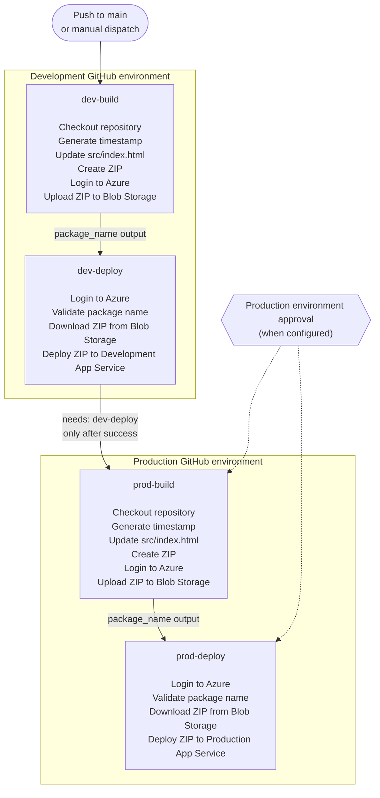
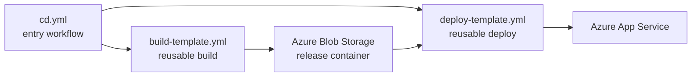
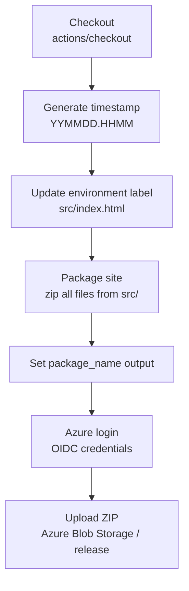
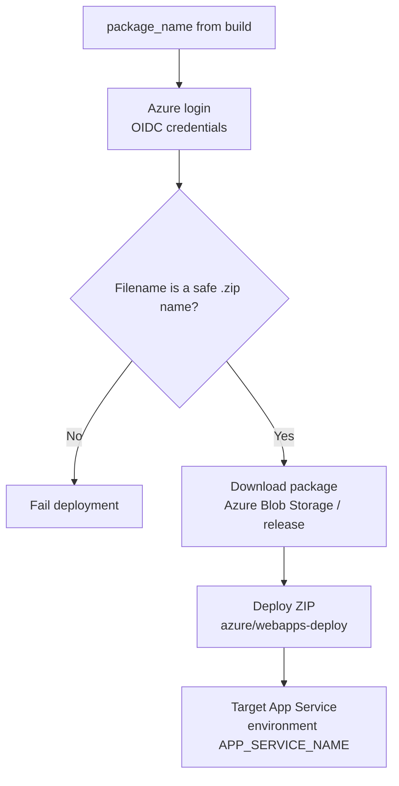
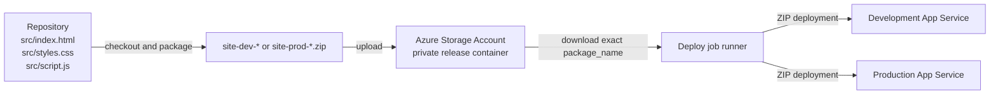

# Application release flow

This document describes the application release performed by
[`cd.yml`](../.github/workflows/cd.yml). It covers the workflow orchestration,
the work performed by each build and deploy job, the artifact lifecycle, and
the Azure resources involved.

## When the release starts

The `Deploy DTAP application` workflow starts when:

- a commit is pushed to `main` (normally an approved pull request merge); or
- the workflow is started manually with **Run workflow**.

The workflow uses the `dtap-${{ github.ref }}` concurrency group with
`cancel-in-progress: false`. A second release therefore waits for an existing
release instead of cancelling it.

## End-to-end release diagram

The production build is intentionally after the Development deployment. Each
environment is built separately, so the Production package contains the
Production environment label and is uploaded under a different package name.
Production cannot start until Development has completed successfully.

## Workflow and reusable-workflow responsibilities

| Workflow/job | Responsibility | Gate or output |
| --- | --- | --- |
| `dev-build` | Calls `build-template.yml` for `Development` with environment code `dev`. | Publishes `package_name`. |
| `dev-deploy` | Calls `deploy-template.yml` for `Development` using the build output. | Must succeed before `prod-build`. |
| `prod-build` | Calls `build-template.yml` for `Production` with environment code `prod`. | Publishes `package_name`. |
| `prod-deploy` | Calls `deploy-template.yml` for `Production` using the build output. | Final release step. |

The entry workflow owns ordering with `needs`. The reusable templates own the
steps that run on the GitHub-hosted runner. Secrets are inherited from the
selected GitHub environment, and Azure access uses the `id-token: write`
permission for OIDC login.

## Detailed build job

The `build` job in
[`build-template.yml`](../.github/workflows/build-template.yml) runs on
`ubuntu-latest` and selects the GitHub environment supplied by the caller.

1. **Checkout** checks out the repository contents.
2. **Generate timestamp** creates a value such as `260914.1850`.
3. **Update environment in site** replaces the text inside the
   `environment-tag` span in the existing `src/index.html` with the
   environment's `ENVIRONMENT` variable. The workflow does not generate a new
   HTML file; it modifies the checked-out file before packaging.
4. **Package site** creates `site-<environment-code>-<timestamp>.zip` and
   includes the contents of `src/` at the root of the ZIP. This means
   `index.html`, `styles.css`, and `script.js` are deployed as site-root files.
5. **Set output** exposes the exact ZIP filename as `package_name` to the
   caller workflow.
6. **Azure login** obtains an Azure session using the environment's OIDC
   client, tenant, and subscription settings.
7. **Upload to blob** uploads the ZIP to the private `release` container using
   `az storage blob upload --auth-mode login --overwrite`.

The package filename is the hand-off between build and deploy. The ZIP is not
passed as a GitHub Actions artifact; it is stored in Azure Blob Storage.

## Detailed deploy job

The `deploy` job in
[`deploy-template.yml`](../.github/workflows/deploy-template.yml) runs on
`ubuntu-latest` and receives the filename produced by its preceding build.

1. **Azure login** authenticates to the subscription configured by the
   selected GitHub environment.
2. **Validate package name** rejects paths and names that are not safe ZIP
   filenames. This prevents the input from being used as an arbitrary local
   path.
3. **Download package from blob** downloads the exact package from the private
   `release` container to the runner with
   `az storage blob download --auth-mode login`.
4. **Deploy to WebApp** uses `azure/webapps-deploy@v3` with the environment's
   `APP_SERVICE_NAME` and the downloaded ZIP.

## Artifact and resource flow

The storage account and App Services are provisioned by Terraform. The
`release` container is private, and the deployment identity requires
`Storage Blob Data Contributor` access. Development and Production use their
own environment-scoped `AZURE_STORAGE_ACCOUNT` and `APP_SERVICE_NAME`
variables, so a deploy job targets only the App Service selected by its
GitHub environment.

## Configuration used by the release

Each GitHub environment supplies:

- `AZURE_CLIENT_ID`, `AZURE_TENANT_ID`, and `AZURE_SUBSCRIPTION_ID` secrets for
  Azure OIDC login.
- `AZURE_STORAGE_ACCOUNT`, identifying the package storage account.
- `APP_SERVICE_NAME`, identifying the target App Service.
- `ENVIRONMENT`, the label written into `src/index.html` during the build.

The production environment can require reviewers. When configured, GitHub
pauses a production job until the required approval is granted.

## Rollback

Packages remain in the `release` container under their timestamped names.
The current `cd.yml` entry workflow always creates a new package, so it does
not yet expose a manual package-selection input for rollback. A rollback
implementation should pass a selected existing filename to
`deploy-template.yml`; the deployment operation itself is immutable because it
downloads and deploys the exact filename supplied to the deploy template.

## Source of truth

- Orchestration: [`cd.yml`](../.github/workflows/cd.yml)
- Build implementation: [`build-template.yml`](../.github/workflows/build-template.yml)
- Deploy implementation: [`deploy-template.yml`](../.github/workflows/deploy-template.yml)
- Azure resources: [`iac/_modules/spa/main.tf`](../iac/_modules/spa/main.tf)
